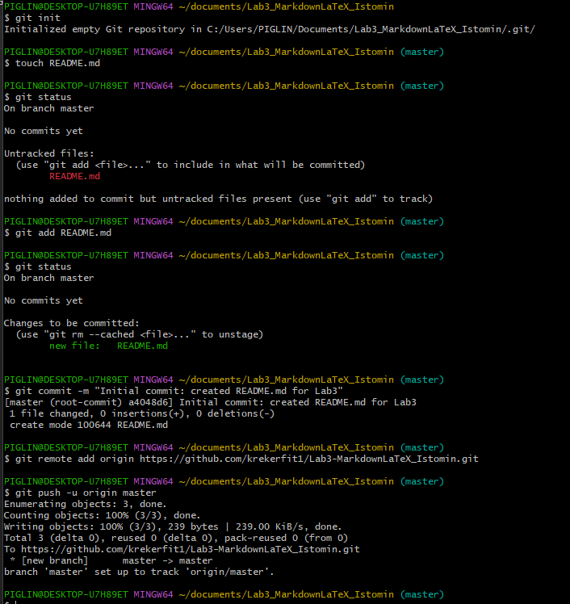

# Лабораторная работа №3: Освоение синтаксиса Markdown и LaTeX

Краткое описание проекта: данная лабораторная работа посвящена изучению разметки использованием языка Markdown и LaTeX. В процессе выполнения создаем документацию репозитория включающая таблицы, списки, блоки кода и математические формулы.

---

## Содержание

- [Структура проекта](#структура-проекта)
- [Примеры форматирования текста](#примеры-форматирования-текста)
- [Списки и задачи](#списки-и-задачи)
- [Цитаты и предупреждения](#цитаты-и-предупреждения)
- [Код и таблицы](#код-и-таблицы)
- [Математические формулы](#математические-формулы)

---

## Структура проекта

* `docs/`
  * `formattingLab3_Istomin.md` — форматирование текста
  * `headersLab3_Istomin.md` — заголовки и структура
  * `linksImagesLab3_Istomin.md` — ссылки и изображения
  * `listsLab3_Istomin.md` — списки
  * `separatorsLab3_Istomin.md` — разделители
  * `codeQuotesLab3_Istomin.md` — код и цитаты
  * `tablesLab3_Istomin.md` — таблицы
  * `advancedMarkdownLab3_Istomin.md` — расширенные возможности
* `latex/`
  * `latexLab3_Istomin.md` — формулы LaTeX
* `img/` — папка со скриншотами выполнения лабораторной работы
* `README.md` — главный файл описания проекта

---

### Примеры форматирования текста

1. **Полужирный текст** для выделения главного
2. *Курсивный текст* для акцентов
3. ~~Зачёркнутый текст~~ для устаревших данных
4. `Моноширинный текст` для обозначения переменных и путей

---

### Списки и задачи

#### Чекбоксы
- [x] Выполнить базовые задания по Markdown
- [x] Добавить математические формулы LaTeX
- [ ] Оформить финальный отчет

#### Нумерованный и вложенный список
1. Этап 1: Инициализация репозитория
   1. Создание структуры папок
   2. Добавление базовых файлов
2. Этап 2: Заполнение документации
3. Этап 3: Пуш изменений на GitHub

---

### Цитаты и предупреждения

> Markdown — это язык разметки, созданный с целью написания наиболее читаемого и удобного описания.

> [!NOTE]
> Это примечание с информацией о проекте.

> [!WARNING]
> Внимание следи за правильным указанием путей к файлам и изображениям.

| № | Файл | Описание |
| :--- | :--- | :--- |
| 1 | `tablesLab3_Istomin.md` | Создание и выравнивание таблиц |
| 2 | advancedMarkdownLab3_Istomin.md | Чекбоксы, сноски, HTML |
| 3 | `latexLab3_Istomin.md` | Инлайн и блочные формулы |
---

### Код и таблицы

#### Блок кода с подсветкой
```
print("Hello World!")
```
### Математические формулы
.

Площадь круга выражается : $S = \pi r^2$

Сумма первых $n$ чисел задается блочной формулой:
$$
\sum_{i=1}^n i = \frac{n(n+1)}{2}
$$

Markdown поддерживает синтаксис LaTeX для отображения математических выражений в веб-интерфейсе GitHub и Gitlab.

---

### Ссылки и медиа

* Внешняя ссылка: [GitHub](https://github.com)
* Внутренняя ссылка: Переход к [Содержанию](#содержание)
* Изображение фиксации изменений:

